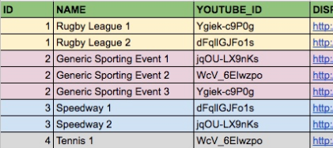
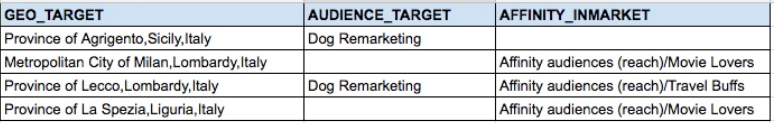
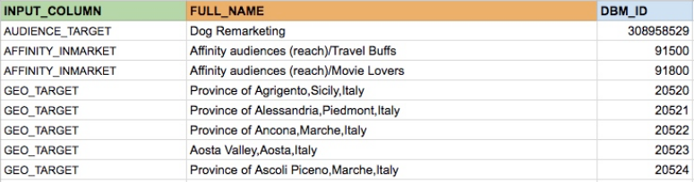
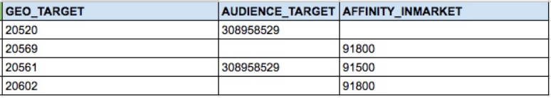

# TrueView SDF Generator

Disclaimer: This is not an official Google product.

## OVERVIEW

The TrueView SDF Generator is a tool that lets you **generate SDF (Structured
Data Files) to create TrueView ads in DV360**, especially useful when you have
many videos (e.g. programmatically generated with tools like "Vogon").

The output SDF-compatible CSV files, once manually uploaded to DV360, let you
create and correctly target the needed Ads, AdGroups, Line Items and Insertion
Orders for each of your input videos, starting from a set of basic default
values and targeting rules.

The tool is accessible via a Google Sheet, which includes the custom Apps Script
code which handles the generation of the output.

**Note:** only TrueView Ads and Bumper Ads (if you're using SDF version >= 4)
are supported.

## INITIAL SETUP

Create a new [Google Spreadsheet](https://sheets.google.com) and open its script
editor (from _Tools > Script Editor_)

*   Copy all the **.js files** from this project in corresponding
    .gs (Code.gs, Utils.gs, SdfObject.gs, Setup.gs) files in your AppScript
    project.
*   Save all the files and refresh your Google Sheet page (the Script Editor
    page will automatically close, that's fine). After a couple of seconds you
    will see a new **TrueView SDF Generator** drop-down menu in the toolbar
    (from now on, "the menu").
*   Click on **Initial Setup** in the menu: this will automatically create the
    three necessary sheets in the document (see below for usage).
*   Please note that the first time you ran the functions in the menu you might
    be prompted to grant the necessary permissions to the tool.

You're ready to start using the tool!

## USAGE

#### 1. Fill out the default values in the "STRUCTURE_AND_DEFAULTS" sheet

*   In the **STRUCTURE_AND_DEFAULTS** sheet you will see a representation of
    all the fields (and corresponding values) needed to describe an Insertion
    Order (IO), Line Item (LI), AdGroup (AG) and Ad (AD). Note: these are the
    same field which are available in the DV360 SDF files - which in fact you're
    going to recreate.
*   You will need to fill out the **default values** for all the relevant
    fields: these will apply to all the IOs, LIs, AGs and ADs that will be
    created.
*   One easy and safe way to do this is to manually create a sample LI/AG in
    DV360, and then **download it as SDF** ([Actions > Download
    SDF](https://support.google.com/displayvideo/answer/6301070)), so that you
    can reuse the same values in the Sheet (_Edit > Paste Special > Paste
    transpose_ will let you copy-paste the SDF values vertically).
*   Pay special attention to the **lightblue fields** (using placeholders - see
    below) and the **yellow fields** for mandatory values such as start/end
    dates (start date has to be in the future) and targeting.
*   You can see a detailed list of **available fields and accepted formats**
    (very important for your upload to succeed!) in the [SDF Documentation for
    Developers](https://developers.google.com/bid-manager/guides/structured-data-file/format)
*   Please note that for targeting lists (or geo-targeting locations) you’ll
    need to **use IDs and not the full names**! (see the _Targeting IDs_
    sections below)
*   The other key part is the use of **placeholders** like _%%ID%%_ or
    _%%NAME%%_ to differentiate values for each LI, AdGroup, Ad corresponding to
    a video in the _INPUT_ sheet (see below). This means that all LIs, AGs and
    ADs will have the same default values listed in the _STRUCTURE_AND_DEFAULTS_
    sheet, except for when a _%%NAME_OF_PLACEHOLDER%%_ notation is used, because
    in that case each LI/AG/AD will have a different value obtained from the
    different (videos/) variants listed in the _INPUT_ sheet.
    -   For instance, to distinguish the Line Items names you might want to
        use _Line Item %%NAME%%_, where _NAME_ is also one of the columns in
        _INPUT_ sheet, containing the different names of your different videos.
*   You will also be able to **manually edit** individual items later (after
    the automatic generation of the tool but before downloading the CSV files
    to upload to DV360).

#### 2. Populate the "INPUT" sheet
*   Add **one row for each iteration (e.g. each video)** that you want to add as
    a Line Item, AdGroup and Ad. You might get these values in an almost
    immediately reusable format as output of the tool which has generated
    those videos (e.g. the CSV output of Vogon)
*   Be sure to have for each row at least a **Name**, the **YouTube ID**, a
    **Display URL** and a **Landing Page URL** (in fact, these are the columns
    that you will already find in the _INPUT_ sheet). These are required to
    create the corresponding Trueview Ad in DV360.
*   You also have an **ID** column which should just be an incremental unique
    number. But this is also used if you want to group some videos (Ads) in
    the same AdGroup: in that case, use the same ID for videos that corrispond
    to different ads of the same adgroup:

    

    So if you have _N_ rows in the _INPUT_ sheet, with _K_ different IDs, you’ll
    generate _N_ Ads in DV360, grouped into _K_ AdGroups (and _K_ Line Items,
    and 1 Insertion Order).
*   You can add additional columns for **fields/settings you want to customize
    at video/ad level** (vs. having a default value for all video/ads): for
    instance, you might want to add a GEO_TARGET column to target each video
    to different locations.
*   Please note that, as mentioned, for targeting lists (or geo-targeting
    locations) SDF require **IDs and not names**! (see the _Targeting IDs_
    sections below).
*   **Order of columns doesn’t matter - names do**: in particular, each _column_
    in the _INPUT_ sheet can be used as a placeholder (through the
    _%%NAME_OF_COLUMN%%_ notation explained in the previous section) in the
    values you have defined in the _STRUCTURES_AND_DEFAULTS_ sheet
    -   For instance, the column _NAME_ can be used to generate Line Item
        names with a default value of Line Item _%%NAME%%_; or you can add
        adgroup-level targeting with a _AUDIENCE_TARGETING_ column in the
        _INPUT_ sheet, and a _%%AUDIENCE_TARGETING%%_ placeholder for the
        corresponding field in the default values

#### 3. Targeting IDs
*   If you're not targeting audience lists, geolocations or other settings
    requiring DV360 list IDs, you can skip this step.
*   SDFs accept targeting clusters (typically Geo-locations and/or
    User/Audience/Affinity/In-market lists) **using their IDs, not their names**
*   **If you are only targeting a few audiences / locations**, the easiest
    approach is to manually check the IDs in the DV360 UI and insert them in the
    _STRUCTURES_AND_DEFAULTS_ sheet (if they apply to all the different
    LIs/AdGroups,...) or with the relevant value in each row of the _INPUT_
    sheet.
    -   If you can't find the ID in the DV360 UI, an even more reliable way to
        do this is downloading the SDF file of a LI/AG which already target
        those lists - the SDF will contain the corresponding ID.
*   Obviously this gets a little more complicated if you have **many rows with
    many different targets**, especially as you might only be familiar with
    their external-facing names, and not the IDs. To convert your names to IDs,
    you have different options:
    -   Download [**Entity Read files**](https://developers.google.com/bid-manager/guides/entity-read/overview)
        to have a complete list of the audiences of your client, and play with
        Vertical Lookups in a sheet to find the correspondence between your
        targeted lists and the corresponding ID.
    -   For **geo-locations**, you can probably more easily find the IDs you
        need using [this Adwords API tool](https://developers.google.com/adwords/api/docs/appendix/geotargeting)
        (the _Criteria ID_ you find there is the ID DV360 needs)
    -   If you have added the name of the targeting location/list names in the
        _INPUT_ sheet, and you have the corresponding DV360 IDs and you “just”
        need to **automatically convert** those names to the corresponding IDs,
        we have added a _NAME_IDS_MAPPING_ sheet where you can add a row for
        each list/location with:
        -   _INPUT_COLUMN_: the name of the column in the _INPUT_ sheet where
            the list/location name would be found.
        -   _FULL_NAME_: the name of the list/location to be replaced in that
            column.
        -   _DV360_ID_: the DV360 ID to replace the name with.
        If you click on _Convert Names to IDs_ in the menu, the tool will
        automatically loop through all the _INPUT_ sheet rows to replace the
        list/location names with the corresponding DV360 IDs.
        See the _Target lists conversione example_ in the _ADDITIONAL INFO_
        section below.

#### 4. Generate the SDF sheets/CSVs and upload them to DV360

*   Click on **Generate SDF Sheets** in the menu to generate the sheets for your
    IOs, LIs, AGs and ADs. This might take a few seconds.
*   Have a look at the new/updated sheets, and if everything looks right
    download the corrisponding CSVs: go into each sheet and select
    _File > Download As > Comma-separated values_ to **download the SDF CSV** to
    upload in the DV360 UI.
*   **Upload your CSVs in DV360**, clicking on _Actions > Upload_ (at Advertiser
    level). In a few seconds you’ll see whether your upload successfully creates
    the new IOs, LIs, AGs and ADs or there have been errors (and which ones).
    More info on how SDF work in DV360 [here](https://support.google.com/displayvideo/answer/6301070).
*   If you need to **edit and re-produce** the sheets/CSVs (e.g. to correct
    wrong formatting which led to an error while uploading) just edit the
    _INPUT_ and/or _STRUCTURE_AND_DEFAULTS_ sheets and generate the sheets
    again.

## Additional Info
*   **Do not edit sheet names**, as they are critical for the script to work
    correctly.
*   **IO-level** default targeting doesn't apply to TrueView line items.
*   Even if **SDF uploading fails** at some point, it will create the IO and the
    other objects that were valid "until that point". Hence, you might need to
    "clean up" the half-baked resulting IO after a failed upload.
*   Sometimes (very rarely) if you're uploading CSVs with many rows/videos, the
    **upload might fail even if the CSVs are correct**.
    You might recognize these "false negatives" when you get, for instance, 3
    errors out of 100 Line Items (and those 3 failing rows are not particularly
    different from the others). In those cases, you might just want to try
    again!
*   **Video targeting**: use YouTube IDs, not full YouTube URLs.
*   All cells in the sheet need to be **formatted as _text_** (even numbers).
    The script takes care of that for the fields it generates, but keep that in
    mind if you manually edit the cells (_Format > Number > Plain Text_ can
    help).
*   **SDF version support**: we are providing the tool to support SDF version 4.
    When using a different version (i.e. your DV360 partner/advertiser has a
    different SDF version settings, and you are not able to change it), a
    different structure of the SDF object might be needed. You can adapt the
    structure in file _SdfObject.gs_ to match the one supported by your SDF
    version.
*   **Example of Target lists names/ids conversion:**
    In the _INPUT_ sheet, we have our list/locations, listed by their names:

    

    We list all the list/location names in the _NAME_IDS_MAPPING_ sheet,
    specifying the name of the column of the _INPUT_ sheet the script needs to
    look into, and the corresponding DV360 ID:

    

    (list continues with all geo-locations for that country/granularity)
    We apply the automatic conversion, clicking on the _Convert Names to IDs_
    option in the Menu.
    If everything has been setup correctly, the _INPUT_ sheet now will show IDs
    rather than names for the lists/locations:

    

    _Note: this example obviously just has a few rows, so a manual replacement
    would have been the quicker solution! But the automated function helps when
    you have many more rows/lists/locations_.
